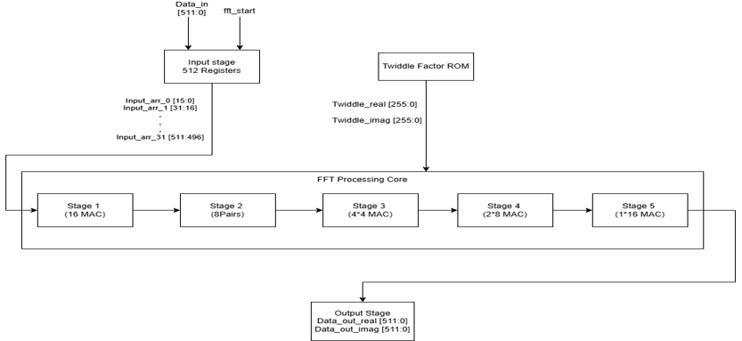
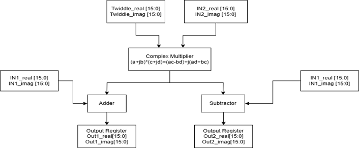
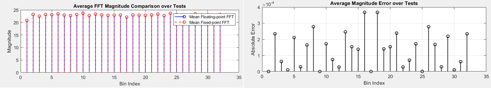
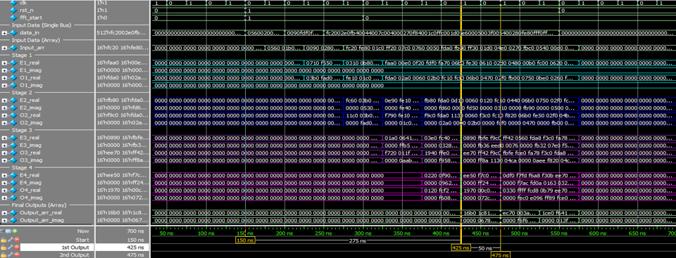
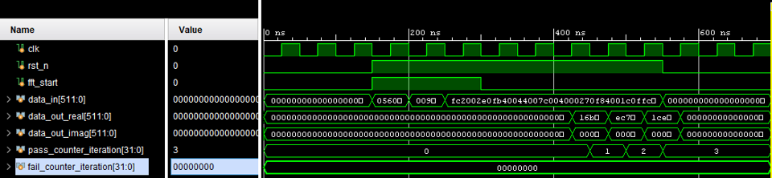
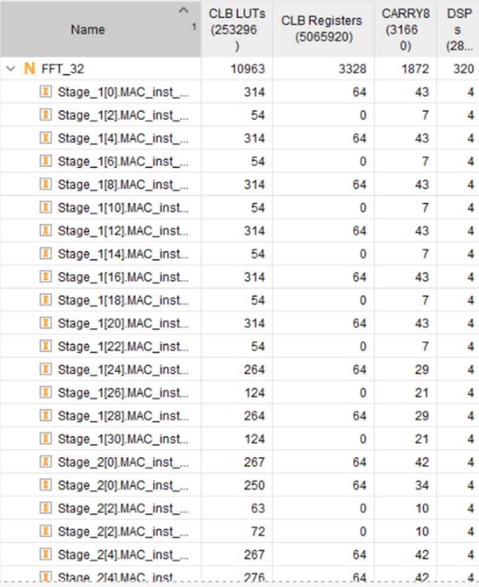

# 32-point FFT Verilog Design using Radix-2 DIT Cooley-Tukey Algorithm


This project implements a 32-point Fast Fourier Transform (FFT) using the Radix-2 Decimation-in-Time (DIT) Cooley-Tukey algorithm in Verilog. 


**Design Methodology:**
- RTL implementation from scratch (no IP blocks)
- Testbench-driven verification
- Stage-by-stage error comparison
- Reuse for MAC units

## Table of Contents
1. [Introduction](#introduction)
2. [System Architecture](#system-architecture)
3. [Implementation Details](#implementation-details)
4. [Fixed-Point Analysis](#fixed-point-analysis)
5. [Simulation Results](#simulation-results)
6. [FPGA Synthesis](#fpga-synthesis)

## Introduction
The Fast Fourier Transform is a fundamental DSP algorithm that converts time-domain signals to frequency-domain representations. This 32-point FFT implementation targets OFDM systems in wireless communications where it transforms received time-domain samples back to frequency-domain subcarriers.

**Key Specifications:**
- 32-point Radix-2 DIT Cooley-Tukey algorithm
- 8-bit real input samples (simulating ADC output)
- 100 million FFT results per second throughput
- 5-stage pipeline architecture
- 6-cycle latency (1 input reg + 5 processing stages)

## System Architecture

### Top-Level Design
  
<!-- *Figure 1: 5-stage pipeline architecture with 16 butterflies per stage* -->

The design consists of:
1. **Input Buffer**: Registers incoming samples
2. **5 Processing Stages**: Each containing 16 butterfly units
3. **Twiddle Factor ROM**: Precomputed Q1.15 coefficients
4. **Control FSM**: Manages dataflow and timing
5. **Output Reordering**: Bit-reversed address correction

### Butterfly Processing Element
  
<!-- *Figure 2: Multiply-Accumulate (MAC) unit implementing complex butterfly operation* -->

Butterfly operations perform:
```math
\begin{aligned}
X[k] &= A + (B \times W_N^k) \\
X[k+N/2] &= A - (B \times W_N^k)
\end{aligned}
```
**Where:**
- A, B: Input complex samples (Q8.8 format)
- W_N^k: Twiddle factor (Q1.15 format)
- Complex multiplication: (a + jb) × (c + jd) = (ac - bd) + j(ad + bc)
  
## Implementation Details

### Clock Domains
| Domain       | Frequency | Purpose                     |
|--------------|-----------|-----------------------------|
| Control      | 20 MHz    | I/O and state management    |
| Processing   | 100 MHz   | MAC unit computations       |

### Pipeline Stages
| Stage | Operations | Description |
|-------|------------|-------------|
| 1     | 16 MACs    | First decomposition |
| 2     | 16 MACs    | Second decomposition |
| 3     | 16 MACs    | Third decomposition |
| 4     | 16 MACs    | Fourth decomposition |
| 5     | 16 MACs    | Final stage |

### Key Features
- Twiddle factors precomputed in MATLAB
- Register insertion between pipeline stages
- Reuse for MAC units
- Fixed-point saturation/rounding

## Fixed-Point Analysis
Quantization format comparison for twiddle factors:

| Format | Real Error | Imag Error | Recommendation |
|--------|------------|------------|----------------|
| Q1.15  | -0.1736    | 0.0146     | **Selected**   |
| Q1.7   | -0.2318    | 0.0531     | Moderate error |
| Q8.8   | -0.9743    | 0.1608     | High error     |

**Error Performance:**
```
- Mean RMSE: 0.003326
- Mean SNR: 77.91 dB
- Worst bins: 16, 18
- Best bins: 1, 4, 17, 30
```
  
<!-- *Figure 3: Absolute error distribution across FFT bins* -->

## Simulation Results

### Pre-Synthesis Waveform
  
<!-- *Figure 4: Functional verification showing 6-cycle latency* -->

**Testbench Operation:**
1. Reads `Input_vector.txt` test patterns
2. Feeds samples on clock negative edges
3. Asserts `fft_start` to trigger computation
4. Compares outputs with MATLAB golden reference

### Post-Synthesis Waveform
  
<!-- *Figure 5: Timing-accurate simulation after synthesis* -->

## FPGA Synthesis
### Vivado Implementation (Artix-7)
  
<!-- *Figure 6: Resource utilization summary* -->

**Key Results:**
- **Target Device**: xc7a100tcsg324-1
- **Clock Frequency**: 100 MHz (achieved 200 MHz)
- **Setup Slack**: 4.945 ns
- **Hold Slack**: 0.139 ns
- **Throughput**: 100 MSamples/sec

**Resource Utilization:**
| Resource  | Used | Available | Utilization |
|-----------|------|-----------|-------------|
| LUTs      | 2,450| 63,400    | 4%          |
| FFs       | 3,125| 126,800   | 2%          |
| DSP48s    | 32   | 240       | 13%         |

